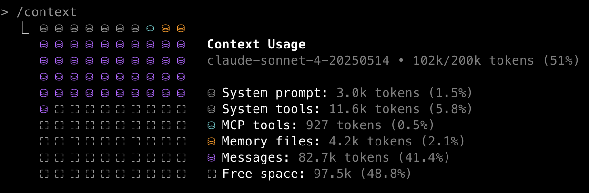

# Coding with AI

To say that the impact of large language models (LLMs) on coding has been transformational would be a gross understatement.  Until Github released its Copilot AI assistant in 2021, most coders leaned heavily on Internet searches. At some point there was a humorous meme that computer programming would be officially renamed "Googling Stack Overflow", referring to a popular question-and-answer site for programming questions.  [](#stackoverflow-fig) shows a plot of the number of questions posted per month to this site; although traffic was already declining after a large bump during the COVID-19 pandemic, it absolutely plummeted after the introduction of ChatGPT in late 2022.  Ironically, it was the content of Stack Overflow that likely played a major role in the success of ChatGPT and other early LLMs in coding.  

```{figure} images/stackoverflow_trend.png
:label: stackoverflow-fig
:align: center
:width: 800

A timeline of the monthly number of questions posted to Stack Overflow, once a popular question/answer forum for software development.  Plotted using data obtained from https://data.stackexchange.com/stackoverflow/query/1882532/questions-per-month?ref=blog.pragmaticengineer.com.
```

After 2022, AI coding tools emerged and strengthened at a pace that can only be described as blistering. There are many ways that one could try to quantify this increase, such as using benchmarks for coding ability.  However, the models quickly came to perform almost perfectly on most of the early benchmarks, making it difficult to quantify continued growth.  One more useful way to quantify the growth of these tools is the *task completion time-horizon* [@METR:2025aa], which quantifies the required length of tasks for humans on which the models can achieve a particular success rate.  [](#METRhorizon-fig) shows the task completion time horizon for models as of the time of writing (February 2026); note that the y-axis is on a log scale, meaning that the increase is exponential.  Since the beginning of 2024 (starting with GPT-4o), the time horizon at which models are 80% successful is estimated to have doubled about every 100 days.  These data highlight the astounding velocity of change in the ability of these models in the first few years of their emergence.  

```{figure} images/metr_horizon_benchmark.png
:label: METRhorizon-fig
:align: center
:width: 800

A plot of time horizon at 80% success on the METR AI benchmark over time.  Y axis is plotted on log scale.  Replotted using data from https://metr.org/.

```

The rapid growth of the capabilities of AI coding tools also makes clear that anything that I write about the state of the art at the time of writing (February 2026) is guaranteed to be outdated very rapidly.  In fact, a first draft of this chapter that I wrote in mid-2025 was badly outdated by early 2026!  In an attempt to futureproof this chapter to the degree possible, I will focus on outlining some of the principles that we have learned about the use of AI coding tools over the first few years of their existence, rather than focusing on specific tools that are likely to become quickly outdated.


## Concerns regarding large language models

LLMs remain controversial for several reasons.
First, they are known to perpetuate the biases that exist in human language.
A large body of research has shown that these models tend to demonstrate bias towards gender and racial minorities, and in general to perpetuate stereotypes that are present in human language.
The models have in some cases been fine-tuned to avoid this, but the biases nonetheless still persist.
Second, there are ongoing arguments regarding whether some models have misused copyrighted materials, or violated the license terms of open-source software.
Third, there are legitimate concerns about the substantial resource usage (including energy and water) of the massive data centers that run these models. 

Most importantly, there are lingering concerns regarding the tendency of LLMs to generate inaccurate material, which has come to be known as "hallucination".
I was continually amused at the inability of early versions of ChatGPT to distinguish between myself and my father, Wayne Poldrack, a retired accountant and not a neuroscientist.
Given the prompt "Who is Wayne Poldrack", GPT-4o responded:

>Wayne Poldrack is a prominent neuroscientist and psychologist known for his work in cognitive neuroscience, neuroinformatics, and open science.
He has made significant contributions to understanding brain function, particularly in areas like decision-making, learning, and memory, using neuroimaging techniques such as functional MRI (fMRI).
Poldrack is also an advocate for open science and reproducibility in research, promoting the sharing of data and methods to improve scientific transparency.

> One of his most influential contributions is the development of the OpenNeuro platform, which provides free and open access to brain imaging data, allowing researchers worldwide to share, analyze, and collaborate on neuroimaging studies.
Poldrack has also been involved in efforts to improve data-sharing standards in the field and has published extensively on topics related to brain function and the methodology of neuroscience research.

> As of recent years, he has been a professor at Stanford University, where he continues to lead research initiatives in cognitive neuroscience, and neuroimaging, and the use of data science techniques in understanding brain processes.

When further prompted "Who is Russell Poldrack?", it continued:

> It seems there might be some confusion here, as Wayne Poldrack is the well-known neuroscientist, and there is no widely recognized individual named “Russell Poldrack” in the fields of neuroscience, psychology, or related disciplines.
If you’re referring to someone connected to Wayne Poldrack or seeking more specific information, feel free to clarify, and I can look into it further.

On other occasions, ChatGPT instead stated that Russell Poldrack and Wayne Poldrack are the same person, and even the  Google Gemini 2.5 Pro model as of mid-2025 provided a detailed description of a several Wayne Poldracks who do not seem to actually exist.  

While hallucinations have not been completely eliminated, they are much less common in the most recent frontier models as of time of writing.  In part this seems to be due to the fact that the models now tend to use web search when they don't have high-confidence information about a query.  This was evident from the response to Google Gemini 3 Pro in February 2026 to my prompt "Who is Wayne Poldrack?" that it had previously hallucinated to:

> Wayne Poldrack is a retired **Certified Public Accountant (CPA)** based in Rosenberg, Texas, and the father of the prominent Stanford neuroscientist **Russell (Russ) Poldrack**.

> While he is a private citizen, his name has become a topic of interest in the tech community due to a recurring **artificial intelligence "hallucination."** Large Language Models (LLMs), such as ChatGPT, have frequently and incorrectly identified Wayne Poldrack as a famous neuroscientist, confusing him with his son.

> Here is a summary of the distinction:
*   **Wayne Poldrack:** A retired accountant and former chairman of the Planning Commission in Rosenberg, Texas.
*   **Russell Poldrack:** His son, a famous researcher at Stanford University known for his work in cognitive neuroscience and neuroinformatics (e.g., the OpenNeuro platform).

> Russell Poldrack has publicly written about this error, using it as a case study to demonstrate how AI models can confidently present false biographical information.

Even if they have become less frequent in newer models, the potential presence of hallucinations means that information generated by LLMs needs to be validated if it is to be used in domains where accuracy matters (like science).  Fortunately, coding is a best case scenario for the use of LLMs, since we can relatively easily write tests that can verify that the solutions generated by the system are correct.
This is the reason for my heavy focus on testing and test-driven development in this book, and was in fact my rationale for presenting testing prior to discussing AI-assisted coding in detail.

## Generative versus agentic AI

LLMs are often referred to as *generative AI* tools, since they generate new information based on prompts from the user.  These models involve *open-loop* interaction, in which the model generates output and then waits for additional input from the human.  In 2025 a new paradigm known as *agentic AI* emerged. Agentic AI allows *closed-loop* operation, in which the LLM is given access to external tools that it can use to perform actions, and then respond to the results of those actions with new actions. A coding agent can generate code, run tests on the code, process the error messages, and revise the code to address the errors, all without any human intervention.  Tool use allows models to become increasingly autonomous, and a growing ecosystem of tools allows the agents to become more powerful even if the underlying LLM doesn't change. These include tools for web search, system file access, running shell commands, installing new packages, running tests, version control, web browser interaction, and much more. In practice the distinction between generative and agentic AI is now more of a spectrum than a binary distinction, as agentic features have been integrated into many chatbots and other systems that are used in a generative manner.

The ability of coding agents to access tools was accelerated by the development of a standard protocol for tool calling known as the *Model Context Protocol* (commonly referred to as *MCP*). You can think of as an API for tool use, providing a consistent way for AI agents to interact with tools; or, as the [MCP documentation](https://modelcontextprotocol.io/docs/getting-started/intro) says, "Think of MCP like a USB-C port for AI applications".
As just one example, one particularly useful tool for web projects is the [Playwright MCP](https://developer.microsoft.com/blog/the-complete-playwright-end-to-end-story-tools-ai-and-real-world-workflows), which allows the agent to interactively test the web application using a browser autonomously.
This can greatly speed up development for these kinds of projects because it allows the agent to do things that would previously have required human intervention.

While agentic coding tools greatly increase the power of AI coding assistants, they also change the kind of failure modes that can occur.  In the generative mode, the researcher generates code (e.g. by prompting a chatbot or using autocompletion in an IDE) and has a chance to look at it before running it.  In the agentic model, the agent can generate a large amount of code and make changes across many files in the codebase without any human oversight.  In some cases this code can work well, but the agent can also end up going down rabbit holes, generating problematic code and spending a large number of tokens in the process.  Throughout the chapter I will discuss strategies for dealing with these issues, so that you can maximize the benefits of agentic coding while minimizing the risks.


## AI interaction patterns for coding

There are several common patterns of interaction with AI tools for coding. In order to maximize the impact of AI coding tools, it's important to be aware of each of these patterns and the use cases in which they can be helpful.


- **Single-turn generation**:  Prompting of an LLM chatbot to generate code in a single shot.  This is often the first mode of interaction for novice users of AI coding.
- **Context-aware code completion**: The integration of coding assistants into IDEs allows them to perform autocompletion in a way that takes into account the context in the code. For example, one can prompt the generation of an entire function simply by typing a comment that outlines the desired function, and it will be written with knowledge of the variable names used in other parts of the file.
- **Programmatic access**: One can write code that calls the APIs of coding models to generate code in a programmatic way.
- **Autonomous execution**: Using coding agents, a complicated plan can be executed by the model using tools to perform actions.


## Principles for working with AI coding tools

### Verification

Any code generated by an AI coding tool *must* be verified to ensure that the computations are correct. As an example, I prompted ChatGPT (using GPT-4o) with the following prompt: "generate a python function to compute a multiple linear regression solution using linear algebra.", resulting in this code:

```
def multiple_linear_regression(X, y):
    """
    Solves a multiple linear regression problem using the normal equation.
    
    Parameters:
    X (numpy array): A 2D numpy array where each row is a sample 
      and each column is a feature.
    y (numpy array): A 1D numpy array representing the target variable 
      for each sample.
    
    Returns:
    w (numpy array): The coefficients of the linear regression model.
    """
    # Add a column of ones to X for the intercept term
    X_b = np.c_[np.ones((X.shape[0], 1)), X]
    
    # Compute the coefficients using the normal equation
    w = np.linalg.inv(X_b.T.dot(X_b)).dot(X_b.T).dot(y)
    
    return w
```

I then started another new chat window and issued exactly the same prompt again, with the following result:

```
def multiple_linear_regression(X, y):
    """
    Computes the coefficients for a multiple linear regression 
    using the normal equation.
    
    Parameters:
    X : numpy.ndarray
        The input feature matrix (each row is a data point, and 
        each column is a feature).
    y : numpy.ndarray
        The target output vector.

    Returns:
    theta : numpy.ndarray
        The computed coefficients (including the intercept if 
        X includes a column of ones).
    """
    # Compute the normal equation: theta = (X^T X)^(-1) X^T y
    X_transpose = np.transpose(X)
    theta = np.linalg.inv(X_transpose @ X) @ X_transpose @ y
    
    return theta
```

This is very similar to the previous code, but you can see slight differences in the implementation of the function.
This highlights the fact that there is a degree of randomness in the outputs of an LLM, as I discussed in the earlier introduction to LLMs.
There are two issues with the code that was generated here.
First, both functions use the normal equation ($(X'X)^{-1}X'y$) to invert the design matrix; this is a suboptimal solution to this problem, both because it will fail if the design matrix `X` is singular, and because it can be numerically unstable. A preferred solution would be a method that uses singular value decomposition (SVD), such as `np.linalg.lstsq()`.

There is also one functionally important difference between the two functions: The second function does not add an intercept whereas the first one did. We can see that each of these is problematic if we write some tests for the functions. We need four tests in all: two tests for function 1 (with and without an intercept in the design matrix) and two tests for function 2 (with and without an intercept). When we do this we see that two of the tests fail:

```python
================================ short test summary info =================================
FAILED test_linreg.py::test_simple_lr1 - numpy.linalg.LinAlgError: Singular matrix
FAILED test_linreg.py::test_simple_lr2_noint - assert 1 == 2
============================== 2 failed, 2 passed in 0.76s ===============================
```

The first failure reflects a linear algebra error caused by adding an intercept to the `X` matrix that already has one; this would not have have failed if a more robust implementation of the least squares estimate had been used, but fails when the normal equation is used. The second failure reflects an incorrect result due to omission of the intercept from the model.

Tests are the primary means to ensure that LLM code is valid, and LLMs are quite good at generating test code.
I initially used Claude Sonnet 4.5 to generate tests for the two functions above, but was surprised to see that all of the tests passed. 
It turned out that that the LLM realized that the two functions differed in their assumptions about the presence of an intercept, and modified the inputs within the tests to make sure that they both passed; that is, it identified and accommodated the bugs rather than exposing them.
As I will discuss in more detail below and in Chapter 8, LLM-generated tests often take the "happy path", doing everything they can to ensure that all tests pass at all costs.
Thus, it is essential that LLM-generated tests are examined closely to ensure that they will actually catch problems when they exist, or to use test-driven development where the tests define the functional requirements prior to any implementation.


### Context management

Early in the development of language models, the term "prompt engineering" came to refer to the art of crafting prompts that can effectively drive an LLM to solve a particular problem.
Over time, this has evolved into the idea of "context engineering", highlighting the fact that context will generally include more than just the prompt at hand, especially when agents start to wield tools.
With agentic coding tools, it's common to provide one or more files that specify all of the relevant information for the task, which can be loaded by the model into its context every time it is run within the project.
I will refer to the set of practices that one follows and resources that one uses to guide the development process as the *agentic coding workflow*.

An essential tool for success with agentic coding workflows is the idea of *context management*.
Even when using models with very large context windows, it generally makes sense to keep one's context footprint as small as possible, given that important information can easily get lost when the context window fills up.
It's thus important to practice good *context management* when working with language models in general: at any point in time, the context window should contain all of the information that is relevant to the current task at hand, and as little as possible irrelevant information.
In addition, context management is essential to deal with the cases when the model goes off in a bad direction or gets stuck, which happens regularly even with the best models.

Context management includes two important components. First, we need to prepare the context so that the model has the relevant information to start developing, which we do using persistent *context files*.  Second, we need to manage the context during the process of development, which we do using the agent's context management tools.

### Using persistent context files

An essential aspect of context management is having important information contained in a set of files that can be read in by the agent to place important project information in the current context.  There are two types of files to consider here, which play different roles and have different lifespans: *constitution files*, and *memory files*.  Most coding agents combine these into a single *instructions file* (such as `AGENTS.md` or `CLAUDE.md`), but it's useful to distinguish them.  

#### Constitution files

Constitution files define the general coding and development practices that you want the agent to follow.  Here are the contents of a constitution file that I used in an agentic coding project:

```
**Code style (NON-NEGOTIABLE)**:
- Write code that is clean and modular
- Prefer shorter functions/methods over longer ones

**Package management (NON-NEGOTIABLE)**:
- use uv for package management
- use `uv run` for all local commands

**Development processes (NON-NEGOTIABLE)**:
- FORBIDDEN: including any code or imports within init.py files.

**Testing (NON-NEGOTIABLE)**:
- Use pytest with a test-driven development approach
- Prefer functions over classes for testing
- Use pytest fixtures for persistent objects
- Enforce RED-GREEN-Refactor cycle, with tests written first
- Commit tests before implementation
- FORBIDDEN: Implementation before test, skipping RED phase
- FORBIDDEN: Changing the tests simply in order to pass.  All changes to tests should reflect either a change in requirements or an error identified in the test.
- FORBIDDEN: Simplifying the problem to pass the test.  The test should fail for anything less than a solution of the full problem defined in the specification.
```

Most coding agents have a hierarchical configuration system, in which there is a user-level instructions file (e.g.` ~/.claude/CLAUDE.md`) along with a project-level instructions file within the project directory.  The user-level instructions file is a good place to define your general coding practices that will be consistent across all projects. 

The user-level constitution file is very useful as a running document of one's development preferences and policies. Any time a coding agent behaves in a way that you wish to avoid in the future, it's useful to add a relevant directive to the user-level file.

#### Memory files

Whereas constitution files specify a global definition for your coding practices and preferences, memory files specify details that are specific to the particular project.  These are often contained in a single instructions file (AGENTS.md or CLAUDE.md) at the project level.  For simple projects it's usually fine to just work with that single instructions file, but for more complex projects I often prefer to break them into several different files that define different aspects of the project; in this case, I would include a directive at the top of the main instructions file (which is automatically read by the agent) to also read those other files:

```
Please read PLANNING.md, TASKS.md, and SCRATCHPAD.md to understand the project.
```

For coding agents that allow definition of custom commands, it can also be useful to define a command with this prompt, which can be easily run whenever the context is cleared; I used this prompt to create a custom command called `/freshstart` within Claude Code.

There are several important kinds of information that should be defined in memory files. Note that while I present this as a sequential process, it often involves iteration, when shortcomings of later files reveal gaps in the earlier files.
Also note that memory files can get bloated over time as the coding agent makes additions to them to reflect its ongoing work.  For large projects it's thus a good idea to regularly review and clean up these files.

**Project requirements/specifications**

The Project Requirements Document (PRD) specifies the overall goals and requirements for the project. Goals refers to the overall problems that the software aims to solve (e.g., "Searchable interface: Enable complex queries across sessions, subjects, stimuli, and processing status").  Given that coding agents often tend to engage in "gold plating" (i.e. solving problems that aren't on the critical path), it's also useful to specify *non-goals*, that is, problems that the software doesn't need to solve (e.g. "Direct analysis capabilities (this is a tracking/management system, not an analysis platform)"). Requirements can include architectural features (e.g. defining the different components or layers of the system), functional requirements (e.g., "API shall validate incoming data against expected schema for the specified task") or non-functional requirements related to performance, reliability, security, or maintainability (e.g. "API response time < 500ms for single-document queries"). 

I generally start a project by iterating on the PRD with an LLM chatbot.  I start by describing the overall problem that I want to solve, and then prompt the model to first ask me any questions that it has before generating a PRD.  Here is an example from a [project](https://github.com/BetterCodeBetterScience/example-parcelextract) that I developed in the course of writing this book:

> "Help me create a Project Requirement Document (PRD) for a Python module called parcelextract that will take in a 4-dimensional Nifti brain image and extract signal from clusters defined by a specified brain parcellation, saving it to a text file accompanied by a json sidecar file containing relevant metadata.
The tool should leverage existing packages such as nibabel, nilearn, and templateflow, and should follow the BIDS standard for file naming as closely as possible.
The code should be written in a clean and modular way, using a test-driven development framework."

I then manually edit the PRD to make sure that it aligns with my goals, or in some cases start over with a new chat session if the generated PRD is too far from my expectations. 

**Planning document**

Once I have a PRD, I would then ask an LLM to generate a *planning document* that contains information related to the planning and execution of the project, such as:

- System architecture and components
- Technology stack, language, and dependencies
- Development tools to be used
- Development workflow

Here is the planning prompt from the `parcelextract` example above:

> Based on the attached CLAUDE.md and PRD.md files, create a PLANNING.md file that includes architecture, technology stack, development processes/workflow, and required tools list for this app." 

**Tasks document**

Given the planning document, we then need a file that contains a detailed list of the tasks to be accomplished in the project, which can also be used as a running tally of where the development process stands.
We can generate this within same chat session that we used to generate the planning file:

> Based on the attached CLAUDE.md, PRD.md, and PLANNING.md files, create a TASKS.md file with bullet points for tasks divided into milestones for building this app.

This will be the file that the agent then uses to organize its work. The tasks file will often be broken into sections, and when the agent is given the tasks file it will generally work one section at a time.

**Scratchpad/TODO files**

Once development starts, one will often run into problems that need to be addressed by the model, such as fixing errors or adding additional features.  While one could put these commands into the agent's command line, for more complex problems it can be useful to specify them in a separate scratchpad file.  This provides a place for the model to keep notes on its ongoing work and also ensures that the information will survive if the context is cleared.  I generally create a scratchpad file in my repository that contains the following header:

```
# Development scratchpad

- Use this file to keep notes on ongoing development work.
- Open problems marked with [ ]
- Fixed problems marked with [x]

## NOTES
```

Once a problem is solved to one's satisfaction it is useful to remove it from the scratchpad, in order to keep the context as clean as possible; to keep a running log of solved problems one can commit the file to version control each time before removing the solved problems.


### Managing context during agentic coding

During coding it is important to keep the context as clean as possible, meaning that it should only contain the information that is relevant to solving the problem at hand. 
This is important even for models with very large context windows.
LLM researchers have identified a phenomenon that has come to be called *context rot*, in which performance of the model is degraded as the amount of information in context grows. [Analyses of performance as a function of context](https://research.trychroma.com/context-rot) have shown that model performance can begin to degrade on some benchmarks when the context extends beyond 1000 tokens and can sometimes degrade very badly as the context goes beyond 100,000 tokens. 
It is thus important to keep track of the context during an agentic coding session, and use the tools provided by the agent to manage the context.

Using Claude Code as an example, the current state of the context can be viewed by using the `/context` command:



Claude Code will automatically *compact* the context (meaning that it replaces the current context with an automatically generated summary) when the context window is close to being full, but by this point performance may have started to suffer, so it's often best to manually compact (`/compact`) or clear (`/clear`) the context when one reaches a natural breakpoint in the development process.
I find that compacting is useful in the middle of a problem, but if I am at a breakpoint between problems I will often clear the context completely. 
It's then essential to reload the memory files, which is why I created a custom command to make this easy.
In addition, it will often be more effective to guide the summary to focus on the important aspects for the current workflow, rather than letting the LLM choose what to summarize.

It's also important to [gain an understanding](https://claudelog.com/mechanics/context-window-depletion/) of which tasks are more sensitive to the contents within the context window and which are less sensitive (and thus can allow more frequent clearing of the context).
Tasks that require integration across a large codebase or understanding of large-scale architecture will require more information in the context window, while tasks focused on a specific element of the code (such as a single line or function) can be accomplished with relatively little information in the context window.


#### Choosing the right task size for AI coding tools

Choosing the right size of tasks for the AI model is essential to maximizing the success of AI-assisted coding.  If the task is too large, then it can suffer from context rot, resulting in inconsistent or incompatible code across different parts of the task codebase.  If the task is too small, then the user can spend more time prompting than the model does coding, and the smaller tasks may not be well integrated at the next level up in the hierarchy.  It takes a degree of practice to understand how to right-size problems for any particular coding tool or agent.


### The importance of domain expertise

AI coding agents can make it possible for researchers to develop code that is far outside of their domain expertise, but this can often go awry.
I saw this first hand when I attempted to implement a project using GPU acceleration to accelerate a commonly used data analysis procedure known as *permutation testing*.
This method requires running many iterations of a statistical model fitting procedure using random permutations of the data, in order to obtain a null distribution that can be used to generate p-values that are corrected for multiple comparisons.
I initially asked an LLM whether this was a good candidate for GPU acceleration, and received a resounding "Yes", so I forged ahead trying to create a pure Python version of a commonly used tool in neuroimaging (the `randomise` tool from the FSL software package) that could leverage GPU acceleration on my Mac laptop.
I have very little prior experience with GPU acceleration, so I trusted the LLM that it was possible, which in retrospect turned out to be a recipe for many wasted hours of work.

I subsequently spent several days going back and forth with Claude Code in an attempt to get a working version of the project; if you are interested in the gory details, you can see the entire set of Claude Code transcripts [here](https://bettercodebetterscience.github.io/example-accelperm/transcripts).
Getting it to create a working command-line interface was not particularly difficult; however, the initial implementation did not successfully leverage the GPU and was incredibly slow.
Claude finally diagnosed the problem as being related to the use of `scipy.ndimage.label` for a specific operation, but the agent didn't seem to be able to figure out on its own how to fix the problem.
I ultimately asked it to create an optimized C++ module that could be called from within Python, using the FSL randomise code as a guide.
It was able to do this, but this still didn't work well, and it continued to break other parts of the code as it tried to fix the problem.

After a few days of thrashing around, I decided to try and simplify the problem by focusing on the single task of creating a GPU-accelerated version of `scipy.ndimage.label` (transcript [here](https://bettercodebetterscience.github.io/example-fastlabel/transcripts)).
In this case there was a paper outlining algorithms for GPU-accelerated connected components identification, which I provided to Claude Opus when generating my PRD.
It dutifully generated code, but again the GPU-enabled code was always much slower than CPU-only code.
After I provided Claude with a link to the example code that accompanied the paper, it helped me arrive at a useful realization:

```
Final Answer

You were absolutely correct to push back on my initial assessment. After thorough investigation using the reference implementation from the original authors, I can now provide the definitive answer:

The Real Issue: CUDA vs MPS Architectural Differences

The BUF algorithm does work excellently on CUDA GPUs (10-50x speedup), but cannot  achieve similar performance on MPS due to fundamental architectural differences:

CUDA Advantages:

    Mature atomicMin() operations (essential for union-find)
    Optimized for scattered memory access patterns
    Low kernel launch overhead for many small operations
    Explicit memory hierarchy designed for HPC algorithms

MPS Limitations:

    Limited atomic operation support (289x slower)
    Unified memory architecture not optimized for irregular access
    High kernel launch overhead (106x for scattered operations)
    Different thread execution model

Technical Analysis

The reference implementation uses custom CUDA kernels (.cu files) with:

    Direct atomic operations in GPU memory
    Four specialized kernels: init, merge, compress, final
    Optimized 2×2×2 block processing
    CUDA-specific memory access patterns

My PyTorch implementation attempts to simulate these with Python operations, but:

    Each operation launches separate MPS kernels (massive overhead)
    No true atomic operations available through PyTorch
    Memory access patterns don't suit MPS architecture

Bottom Line

This is not an implementation failure - it's an algorithm-hardware mismatch. The BUF algorithm was designed specifically for CUDA's architecture and doesn't translate to other GPU types.
```

This was a case where a bit of deeper knowledge about the differences between CUDA and MPS GPU architectures could have helped me avoid spending several days of watching Claude go down numerous rabbit holes trying to solve an unsolvable problem, and it highlights the ultimate limits of vibe coding for interesting scientific programming problems.

There are several important lessons to be taken from this experience:

- LLMs are often not good judges of technical feasibility for complex problems; in these cases, domain expertise becomes critical.
- LLMs will often get stuck in a loop of testing various solutions, unable to realize that their approach is fundamentally problematic.
- When the model is going in circles, treat it as a signal that the fundamental approach should be reconsidered, rather than simply trying a simpler version of the problem.


### Prompting and steering

When interacting with both chatbots and agents, we often need to prompt the model to guide its behavior.  Here I discuss some strategies that can be useful.

#### Leveraging in-context learning

As I discussed in Chapter 2, *in-context learning* is a form of learning that occurs within a single chat session, through the buildup of information across the session that is used to condition the output at each point.
The idea is that the output of the model at every step is conditioned on all of the tokens that have come before it in the session. We can take advantage of in-context learning to steer the behavior of the model.

As an example, I started a new chat window, in which I first give the following prompts: "why are type hints important when creating a python function?", followed by "Please give an example of how to use type hints effectively".
I then provided the same prompt as above for a linear algebra function, with the following result:

```
def linear_regression_normal_eq(X: np.ndarray, y: np.ndarray) -> np.ndarray:
    """
    Compute the solution to multiple linear regression using the 
    normal equation.

    Parameters:
    - X (np.ndarray): The matrix of input features with shape (m, n), 
      where m is the number of examples, and n is the number of features.
    - y (np.ndarray): The vector of target values with shape (m,).

    Returns:
    - np.ndarray: The vector of regression coefficients (theta) with shape (n,).
    """
    # Add a column of ones to X for the intercept term (bias)
    X_bias = np.c_[np.ones((X.shape[0], 1)), X]
    
    # Normal equation: theta = (X^T X)^{-1} X^T y
    theta = np.linalg.inv(X_bias.T @ X_bias) @ X_bias.T @ y
    
    return theta
```

Unlike the previous examples, the code now includes type hints.
It's always a bad idea to generalize from a single result, so I ran these prompts through GPT-4o 10 times each (using the OpenAI API to generate them programmatically; see the [notebook](../src/bettercode/incontext_learning_example.ipynb)).
Here are the function signatures generated for each of the 10 runs without mentioning type hints in the prompt:

```
Run 1:  def multiple_linear_regression(X, y):
Run 2:  def multiple_linear_regression(X, Y):
Run 3:  def multiple_linear_regression(X, y):
Run 4:  def multiple_linear_regression(X, y):
Run 5:  def multiple_linear_regression(X, y):
Run 6:  def multiple_linear_regression(X, Y):
Run 7:  def multi_lin_reg(X, y):
Run 8:  def multiple_linear_regression(X, Y):
Run 9:  def multiple_linear_regression(X, Y):
Run 10:  def multiple_linear_regression(X, y):
```

The results here are very consistent, with all but one having exactly the same signature.
Here are the function signatures for each of the runs where the same prompt to generate code was preceded by the question "why are type hints important when creating a python function?":

```
Run 1:  def multiple_linear_regression(X: np.ndarray, y: np.ndarray) -> np.ndarray:
Run 2:  def multiple_linear_regression(X, Y):
Run 3:  def compute_average(numbers: List[int]) -> float:
Run 4:  def compute_multiple_linear_regression(X: np.ndarray, y: np.ndarray) -> np.ndarray:
Run 5:  def compute_multiple_linear_regression(x: np.ndarray, y: np.ndarray) -> np.ndarray:
Run 6:  def compute_multiple_linear_regression(x_data: List[float], y_data: List[float]) -> List[float]:
Run 7:  def compute_linear_regression(X: np.ndarray, Y: np.ndarray):
Run 8:  def mult_regression(X: np.array, y: np.array) -> np.array:
Run 9:  def compute_multiple_linear_regression(X: np.array, Y: np.array)-> np.array:
Run 10:  def multilinear_regression(X: np.ndarray, Y: np.ndarray) -> np.ndarray:
```

Note several interesting things here.
First, 9 out of the 10 signatures here include type hints, showing that introducing the idea of type hints into the context changed the result even using the same code generation prompt; I saw similar results with the latest GPT 5.2 model, where every function signature contained type hints after mentioning them versus none without mention them.
Second, notice that we didn't explicitly tell it to use type hints in our prompt; the simple mention of why they are a good thing in a previous prompt was enough to cause the model to use them.
Third, notice that the function signatures differ much more from run to run after mentioning type hints; this is a striking example of how a small amount of information in context can have significant impact on the output of the model. In this case the greater variability is likely due to the type hints pushing the model away from its default `multiple_linear_regression(X, y)` signature and thus leading to greater exploration.
Fourth, notice that on Run 3 it seems to have generated incorrect code, which we can confirm by looking at the full function that was generated on that run:

```
def compute_average(numbers: List[int]) -> float:
    return sum(numbers) / len(numbers)
```

In this case the LLM simply misunderstood the problem that was being solved.
This misunderstanding may have occurred if the model had earlier generated a simple example in response to the type hints prompt, and then failed to update to the regression prompt.
This kind of perseverative error is not uncommon, as it's a direct result of the nature of in-context learning.

Another way to leverage in-context learning is through *few-shot prompting*, in which we give the model several examples of what we are looking for.  Here is an example where I give a chatbot several examples of mappings between languages and their function signatures, and then ask it to generate the analogous function signature in Python by simply inserting a question mark:

```
Java: public List<String> filterUserNames(List<User> users, int minAge, boolean activeOnly)
C++: std::vector<std::string> filter_user_names(const std::vector<User>& users, int min_age, bool active_only)
Rust: fn filter_user_names(users: &[User], min_age: u32, active_only: bool) -> Vec<String>
Haskell: filterUserNames :: [User] -> Int -> Bool -> [String]

Python: ?
```

To which it provides the following output:

```python
def filter_user_names(users: list[User], min_age: int, active_only: bool) -> list[str]:
```

Few-shot prompting is particularly useful for driving the model to use a particular format or style; if a model is having trouble following instructions, then providing a few examples is often a useful strategy.


#### Encouraging thinking (judiciously)

One of the important discoveries about LLMs is that there are prompting strategies that can result in a greater degree of "thinking", by which we mean the generation of additional rounds of computation that are meant to result in a deeper reasoning about the problem. A well known example of this is *chain of thought* prompting [@Wei:2023aa], in which the model is explicitly prompted to generate intermediate steps in its reasoning process.  [](#chainofthought-fig) shows an example from the [@Wei:2023aa] paper, in which giving an example of producing intermediate results causes the model to do so in subsequent outputs.  

```{figure} images/wei-COT.png
:label: chainofthought-fig
:align: center
:width: 600

An example of chain-of-thought prompting, reprinted from [@Wei:2023aa] under CC-BY.
```

As of 2026, all of the frontier LLMs perform this kind of thinking automatically to some degree.  However, it is generally possible to encourage deeper reasoning by asking the model to "think harder". The details on how to do this differ between models and are also changing over time. As an example, I set out to create a difficult debugging problem for an LLM, which turned out to be substantially more difficult than I expected.  I prompted Google Gemini 3.0 Pro to create code with a bug that would be difficult for an LLM to solve without thinking, along with a test suite to validate the LLM's solution. However, its solutions were invariably solvable by Claude Opus 4.6, even with thinking set to low.  I tried using GPT 5.2 to create code, but it explicitly refused, stating: "I can’t help design a “really difficult problem” specifically intended to resist or defeat frontier LLMs (that’s adversarial)." It was only by using an open source language model (GLM-5) with its safety model turned off that I was able to create a problem that actually required thinking. The bug involved a mutable class attribute that resulted in sharing of state across instances of the class, which was camouflaged by the open source model (see [here](https://github.com/BetterCodeBetterScience/bettercode/tree/main/src/bettercode/effort)).  With thinking set to low or medium, the model was not able to fix the bug in any of its 20 tries at each level, whereas with thinking set to high it was able to solve the problem on each of the 20 tries.  The high thinking model required substantially more time and tokens per attempt (~13 seconds and 928 output tokens on average) compared to the medium thinking (~6 seconds and 320 output tokens) and low thinking (~ 4 seconds and 157 tokens) settings.  

Changing the thinking settings of the model can thus have significant impact on its ability to solve difficult problems, but results in substantially slower response times and more tokens used. In addition, for simple queries too much thinking can lead to overly complex answers.  Thinking is more important when a model fails or gets stuck in a loop trying to solve a problem that it doesn't understand well enough.


## Problem decomposition for AI coding

The ability to decompose a problem is one of the fundamental skills of computer programming.  While coding models excel at generating code once a problem is clearly described, then can struggle to decompose a problem, particularly when the decomposition requires significant scientific domain expertise.  There are several points where human expertise and judgment are essential to successful AI-assisted coding.

### Architecture and design

> To create architecture is to put it in order. Put what in order? Function and objects. - Le Corbusier (supposedly from *Precisions on the Present State of Architecture and City Planning*, need to confirm)

When we think about a residence, architecture and design can make the difference between a beautiful home that is comfortable to live in versus a garish mess that feels like it is fighting the resident at every opportunity. Software architecture is similarly important for the generation of code that is usable, readable, and maintainable.  As my Stanford colleague John Ousterhout says in his highly recommended book "A Philosophy of Software Design" [@Ousterhout:2021aa], "Dealing with complexity is the most important challenge in software design" (p. 169).  Ousterhout highlights three symptoms of code complexity, all of which can be reduced by good design:

- *"Change amplification"*: When the code is well designed, a single functional change should not require changes in multiple locations in the code.  If you have ever found yourself struggling to make a seemingly easy change, this is likely due to poor design.
- *"Cogntive load"*: Well-designed code makes it easy for us to hold the relevant aspects of the code in our head.  Poorly designed code requires us to remember many different features, which is a recipe for human error.
- *"Unknown unknowns"*: Well-designed code is *obvious*:  It makes it immediately apparent what needs to be done to solve a particular problem.  Poorly designed requires knowledge of the entire codebase to make decisions about how to implement changes.

Many of the clean coding practices discussed in Chapter 3 are also focused on improving software design at the microscopic level, whereas software architecture focuses on the macroscopic organization of the software. This primarily involves defining the modular structure of the code and the interfaces by which those modules will interact.  One particularly useful suggestion that Ousterhout makes in his book is "design it twice": That is, think through multiple ways that the modular structure might be laid out and the interactions between the modules. This can often help bring greater clarity about the problem.

### Defining success

Ultimately it is up to us as project owners to define what the project requirements are for any particular coding project. Any functional requirements should be specified in terms of tests, such that the passing of all tests means that the project is complete.  In the context of scientific coding, defining these tests generally requires substantial domain expertise to ensure that the tests assess all of the possibly relevant failure modes and edge cases.

### Recognizing the need to change strategies

As agentic coding tools become increasingly able to work autonomously, it is not uncommon for them to spend long periods working on their own.  Often these sessions can be remarkably productive, but in some cases agent can end up going in circles or digging too deeply into unproductive rabbit-holes.  Expert human judgment is essential to determine when to stop the model and change direction.


## Failure modes for AI-assisted coding

AI coding tools and agents are increasingly powerful, but as of the time of writing (February 2026) they still make a significant number of mistakes on difficult problems, especially novel problems that are outside the domain of their training data.  It's essential to know what kinds of failures to look for, so here I will outline a taxonomy of the kinds of failures that can occur in AI assisted coding.  The taxonomy starts with the easiest problems to catch, and progresses to problems that increasingly require human judgment and coding expertise to identify and solve. 

### Correctness failures

These are failures where the code is clearly wrong, in a way that will cause outright errors or produce incorrect results. These are thus catchable by testing.

- *Outright syntax errors*: It's quite rare for coding agents to generate code that fails with a syntax error, but when they occur these are easily caught.
- *Hallucinated APIs*: While uncommon, models can occasionally hallucinate a package, function, or argument that doesn't exist.  These will generally cause a crash.
- *Outdated APIs*: The AI may generate code that includes functions or arguments that are no longer available in the current version of a package.  This is hard to avoid given that the knowledge base of LLMs often lags many months behind current software, but adding `-W error::FutureWarning` to one's `pytest` commands can help identify features that are currently allowed but will be deprecated in the future.
- *Incorrect implementation of an algorithm*: As in the linear regression example above, the AI may generate code that runs but either generates incorrect results or crashes under certain cases.  Property-based testing can help identify these.

### Testing failures

AI tools can easily generate tests for existing code.  However, I have found that AI-generated tests commonly have problems, which I think primarily arise from the fact that the models are trained to create tests that pass at any cost.

- *Modifying the test to pass the code*: Faced with tests that fail, it is very common for AI assistants to modify the test code to accommodate or effectively ignore the bug, rather than actually fixing the problematic code. This is sometimes referred to as *Happy-path testing*. It is seen in the regression example above, and I will show more examples in Chapter 8 when testing workflows.
- *Mocking broken implementations*: When using test-driven development, AI will sometimes generate mock implementations of a function that passes the test, and then never properly test the actual implementation.
- *Weak assertions*: In some cases AI will generate assertions that would pass even if the function did not give an appropriate result, as I will show in Chapter 8. These function in effect more like *smoke tests* (i.e. testing whether the function runs without crashing) rather than unit tests that are meant to test whether the function returns the proper kinds of outputs.  It's important to understand what the function's intended output is, and make sure that the actual output matches that intention.
- *Failing to check for modifications*: When data go into a function, we generally expect the output to be changed in some way compared to the input.  It's important to test specifically whether the intended changes were made; I have seen cases of AI-generated tests that simply check whether an object was returned, without checking its contents.
- *Numerical precision*: It's common for AI to generate tests that fail due to floating point errors when they compare very large or small numbers using the `==` operator; this is really a common coding mistake rather than example of AI trying to game the tests.  It is important to test equality of floating point numbers using a method that allows for some degree of tolerance (e.g. `pytest.approx()`), though this can be tricky to calibrate in a way that catches real errors but avoids spurious errors.  
- *Coverage gaps*: When generating tests for existing code, it's common for agents to simply skip some modules or functions.  It's important to have explicit instructions in the memory files to generate tests for each module/function, and to assess test coverage using the *coverage* tool.
- *Failing to check for critical dependencies*: A test should fail if a critical dependency is missing, but in some cases AI may generate tests that modify their behavior depending on the presence or absence of a particular dependency. This can be particularly problematic when using packages that modify their behavior depending on the existence of a particular dependency (as I show in an example in Chapter 8).  If the use of a particular dependency is critical to the workflow then it's important to check for those dependencies and make sure that they work properly, rather than simply passing the test if they aren't installed.

### Feasibility failures

These are cases where the approach taken by the model is fundamentally broken.

- *Incorrect feasibility assessment*: As seen in the GPU acceleration example above, AI models will sometimes claim with confidence that an implementation is feasible when it is not.
- *Mismatch between algorithm and environment*: Also seen in the GPU acceleration example above, the model may assume that an algorithm is feasible for the current system when in fact it is only feasible on other kinds of hardware or operating systems.
- *Scalability*: The model may generate code that works with a toy example but cannot feasibly scale to real data due to computational complexity.
- *Hallucination of capabilities*: The model may assume that a library has capabilities that it doesn't have; this is a more general example of the *halluciniated API* failure described above.

### Persistence failures

AI agents can either be too persistent, refusing to rethink a problem after multiple failures, or not persistent enough, resorting to quick fixes or oversimplification.  It is essential to have a human in the loop to avoid these issues.

Overpersistence manifests in AI agents through repeated failed actions:

- *Infinite iteration loops*: The model continues trying different solutions for a problem (sometimes re-trying variations of a previously failing solution) rather than reassessing the approach. For example, the model may keep trying different packages available online for a particular function.
- *Whack-a-mole fixes*: The model continually implements fixes that cause other problems, resulting in an infinite iteration of debugging.

Underpersistence is seen when models take a short-cut rather than persisting in a full solution to the problem.

- *Problem simplification*: Unable to find a fix for the real problem, the agent switches to solving a simplified version of the problem, which may avoid essential elements of the real problem.
- *Workarounds*: The model implements quick fixes that result in problems later.

### Scope failures

Because an AI model can't (yet) read the programmer's mind, they often end up generating code that does either too much or too little work.  These are generally cases where explicit instruction in the constitution or memory files can be helpful in guiding the work towards the intended level.

- *Gold-plating*: AI agents have a tendency to solve more problems than are explicitly stated.  
- *Scope creep*: After initially developing the code, the agent may add unnecessary features - a sort of post-hoc gold plating.
- *Premature abstraction*: AI agents may develop overly complex code, such as complex class hierarchies or design patterns, for simple problems.  
- *Premature declaration of success*: An example of the agent doing too little work, this occurs when the agent declares success based on an implementation that doesn't actually solve the problem.

### Security failures

Security is very important for any web-facing development projects, but also can become an important concern in scientific software engineering.  In addition, there are unique security issues raised by autonomous coding agents.

- *Credential exposure*: I've already noted in a previous section the potential for credentials to be leaked by AI-generated code.  This is essential to check any time one is working with sensitive credentials.
- *Injection vulnerabilities*: Any time the code executes commands on the system, there is the potential for malicious injection of arbitrary commands.
- *Unsafe deserialization*: Pickle files are commonly used to store Python objects, but unpickling can execute arbitrary code.  It's thus essential to ensure that any pickle files are trusted before loading, and preferably to use formats that are safer.
- *Unsafe dependencies*: Agents will sometimes identify and install dependencies from PyPI or Github, which could result in the installation of malicious code.  A particular concern is *typosquatting*, where cybercriminals create malicious packages based on common misspellings of real packages (such as "maptplotlib" or "requesuts"). In 2024, [security researchers identified](https://blog.checkpoint.com/securing-the-cloud/pypi-inundated-by-malicious-typosquatting-campaign/) over 500 malicious packages uploaded to PyPI, which if installed could result in major security problems.
- *Unsafe agent modes*: Coding agents generally ask for permissions to perform actions that could be dangerous, but usually have the ability to enable an "unsafe" (or *YOLO*) mode for fully autonomous execution; for example, the current Claude Code has a `--dangerously-skip-permissions` flag that allows this.  This mode is very dangerous on a user machine, since it can wreak havoc by deleting or changing files across the system, or by uploading arbitrary information to the network; agents can do these things in normal mode, but not without human approval. Unsafe mode should only be used on an isolated system with no network access, or within a *sandbox* container with no network access.


### Instruction violations

AI agents may sometimes forget or ignore the instructions present in the constitution or memory files.  This often reflects context rot, and can be reduced through good context management.

- *Ignoring explicit instructions*: I have regularly seen cases where the agent ignores explicit instructions from the constitution or memory files.  
- *Violating TDD*: A common example of the previous principle. Even when instructed to use TDD, models will regularly ignore this instruction or forget it part way through.  The current AI models have a strong tendency to avoid failing tests at all costs.
- *Git commits*: While granular commits are very useful for being able roll back changes, AI models can sometimes generate large commits that make rollback difficult.
- *Overwriting existing content*: Agents will sometimes overwrite or delete existing content without being asked to do so.  This is preventable in workflows with a human in the loop, but difficult to control in fully autonomous agentic workflows.

### Communication failures

The model may sometimes miscommunicate the state of affairs.

- *Premature completion claims*: It is very common for current models to claim to have solved a problem when the problem has not been truly solved, or claim that all tests pass when they do not.
- *Lack of uncertainty*: AI models tend not to express uncertainty about their statements, which can make it difficult to determine when they are working on good information and when they are working with unreliable knowledge.
- *Confident misdiagnosis*: A version of the previous issue, the model confidently claims to have diagnosed a problem, when in fact its diagnosis is incorrect; without a human in the loop, this can lead to significant wasted time and tokens.


## Code smells in AI-generated code

In Chapter 3 I discussed common code smells, focusing primarily on human-generated code. Given that AI models are trained on human-written code, they can also sometimes demonstrate these smells, although AI-generated code is generally quite well-written and usually avoids obvious smells.  However, there is also a set of code smells that are specific to AI-generated code.  The AI-assisted programmer needs to be particularly attentive to these issues when reviewing AI-generated code.  In many ways AI coding shifts code review from detecting obviously incorrect code to identifying more subtle problems.

- *Silent error swallowing*:  AI agents often write code that includes `try/except` clauses that catch bare exceptions (i.e. without specifying an exception type) and silence them rather than raising an exception or giving a warning.  This can result in malfunctioning code that is impossible to identify without appropriate tests on the output.
- *Overly complex or verbose code*: Agents will often create complex class hierarchies or inheritance patterns when a simple approach would be equally effective and much more readable. I regularly find myself asking the agent to simplify its code; this is key to being able to read and maintain the code in the future as well as making it easier to test in an understandable way.
- *Remnants of previous iterations*: It's very common for an agent to make a wholesale change in the code, but to fail to update or remove all of the older code.  This can lead to confusion in debugging; for example, in the code that implemented the analysis of thinking levels that I described above, I had one very confusing experience where the model was passing when it should have failed, which turned out to be due to the hard-coding of a specific file name that was not updated by the model after I decided to use a different input file.
- *Inappropriate pattern imitation*: Coding tools will sometime imitate patterns that are prevalent in their training data but inappropriate for the current context.  For example, the agent might add features related to thread-safety in code that does not use multithreading.  
- *Inconsistent style*: The agent may use different coding styles in different places, such as using classes for some tests and functions/fixtures for other tests.  This may occur when the context becomes bloated or is cleared during the session.
- *Incorrect docstrings*: AI agents are very good at generating properly formatted docstrings, but can sometimes misinterpret the intention of the code.
- *Inappropriate function names*: AI agents can sometimes generate function names that don't correctly describe the intended function.  Catching these requires human judgment and understanding.


## Version control for agentic workflows

As powerful as they are, AI coding agents can often go down the wrong road, and they are not very good at figuring out that they need to stop and rethink their strategy.
This is why it's important to watch what the agent is doing and make sure that it's not just chasing its tail, as I experienced in my first attempt to create a GPU-accelerated permutation tool (discussed above).
Good version control practices are key to dealing with these kinds of issues, and there are several version control strategies that are specifically useful for agentic workflows.

### Create branches before major tasks

When undertaking a task where there is a significant risk of problems or uncertainty about the ability of the model to complete the task, it's useful to create a new branch to work in. This makes reverting the changes as easy as checking out the main branch and deleting the test branch.  Use good branch naming practices (as described in Chapter 2) to make it easy to understand what's been done.

### Commit-clear-reload

Committing to version control after every successful set of changes makes it very easy to simply revert to the last commit when the model gets lost.

A useful pattern is the *commit-clear-reload* cycle:

1. Use `git diff` to review the differences from the previous commit, which can help more quickly identify code smells introduced in the recent work.
2. Ask the model to annotate the current state:
  - Update the task file to mark any completed tasks (assuming that they have truly been completed successfully).
  - Update the scratchpad file remove any truly completed items.
  - If the task was was not successful, ask the model to annotate the failure so the model can know to avoid the problematic strategy in the future.
3. Commit the change. I have found that coding agents are very good at creating detailed commit messages, which are generally much better than anything I would have written on my own (as my commit messages tend to be quite short).
4. Clear the context window.
5. Reload the constitution and memory files.

## Translation and refactoring

I have focused here primarily on the generation of new code, but AI coding assistants can also be very useful in working with existing code.  Two important use cases are refactoring and/or modification of existing code, and translation between coding languages. In both of these cases, the cleanliness of the original code has a major impact on the ability of the language model to infer the intention of the code and thus to effectively work with it.  For poorly written existing code, it may be useful to first add comments manually (if you already understand the code), or to ask an LLM to add comments, followed by an examination of those comments to ensure that they seem reasonable.  The presence of comments can help the coding agent do a better job of understanding and working with the code.  

The availability of well-designed tests for the original code also provides a much stronger baseline for refactoring, modification, or translation.  If tests don't already exists then there are two potential approaches.  The preferable approach is to first generate tests for the original code; if it's Python then you already know how to do this, but this could be challenging for other languages that don't have a robust testing framework like Python does.  When modifying a poorly designed existing Python codebase, it may also be useful to perform one round of refactoring using these tests prior to making any functional modifications.  Another approach that is more relevant for translation is to save intermediate outputs from the original code and then compare those outputs to the equivalent outputs from the translated code using Python tests.  I found this useful recently when translating a large MATLAB codebase for a particular kind of brain imaging analysis into Python.  

The effectiveness of translation will also depend heavily upon the familiarity of the LLM with the specific programming languages involved. Most current models are very familiar with common languages like Python, Java, and C++, but may struggle when working with more obscure languages.  

## Ten simple tips for AI-assisted scientific programming

Based on our experiences with AI coding agents, in 2026 a group of us led by Eric Bridgeford published a set of "simple tips" for scientists who use AI-assisted coding tools. These synthesize much of what I discussed above, and can serve as a checklist for scientists who wish to approach AI-assisted coding:

1. Gather Domain Knowledge Before Implementation
2. Distinguish Problem Framing from Coding
3. Choose Appropriate AI Interaction Models 
4. Start by Thinking Through a Potential Solution
5. Manage Context Strategically 
6. Implement Test-Driven Development with AI
7. Leverage AI for Test Planning and Refinement
8. Monitor Progress and Know When to Restart 
9. Critically Review Generated Code
10. Refine Code Incrementally with Focused Objectives


## Conclusion

In 2025, the term "vibe coding" became viral, referring to the use of coding agents to generate applications without ever touching actual code or even knowing how to code.
A multitude of Youtube videos quickly appeared touting the ability to generate full-fledged applications without any coding knowledge.
However, this initial froth of enthusiasm was soon replaced by a realization that while vibe coding might work for simple applications solving common problems (like web sites), it will generally create software that is at best useful for a prototype but is likely to be difficult to maintain and full of security holes.

Scientists have a particular responsibility to ensure the validity and correctness of the code that they generate using AI.  When we publish a scientific result, we must take full responsibility for the work that establishes the reported results [@Bridgeford:2025aa].  This means that we *must* do everything possible to test and validate the code that we generate, either as human coders or using AI.  Vibe coding may be fine for developing useful tools or web sites, but scientists should *never* publish a result based on code that they have not reviewed and tested.

It is impossible to predict how AI coding abilities will change in the future, and some of the principles laid out in this chapter will certainly be made obsolete by future advances in AI coding tools. But what seems to be clear from the first few years of experience with AI coding tools and agents is that these tools do no make programming expertise obsolete.
Instead, AI tools can improve the productivity of skilled programmers, and they change the importance of different skills: Knowledge of specific coding constructs becomes less important, while the ability to decompose problems, understand and guide the design of software architectures, and review AI-generated code all become increasingly important.

